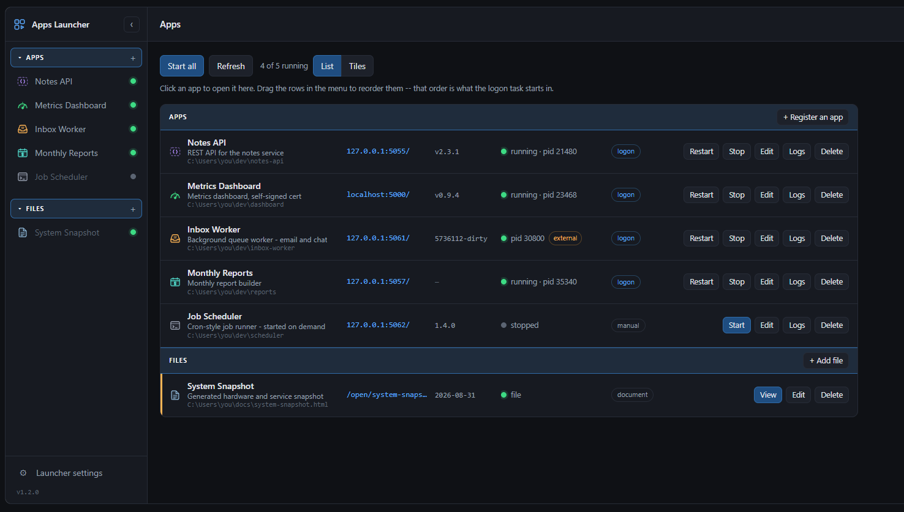

# Apps Launcher

[](https://github.com/jcampbellvergeio/apps-launcher/actions/workflows/ci.yml)

Starts the local apps you otherwise launch by hand after every reboot, and gives
you a page to see and control them: one registry file, one Python engine, an
autostart entry for your platform, and a small Flask UI.

**Windows, Linux and macOS.** Needs Python 3.8+ and Flask. `psutil` is optional
and recommended — see [Dependencies](#dependencies).



## What it does

- **Registry** — `apps.json` lists your apps: folder, command, args, port, URL.
- **CLI** — `devapps.ps1 start|stop|restart|status|logs` over that registry.
- **Logon task** — one command registers it, and a reboot brings everything back.
- **Web UI** — a left menu of every app with live status, a management list, and
  each app embedded in a pane when you click it.

## Install

```sh
git clone https://github.com/<you>/apps-launcher.git launcher
cd launcher
pip install -r requirements.txt
```

Then, on **Linux or macOS**:

```sh
./devapps install          # start at login; see Autostart at login
./devapps start            # or: python3 app.py
```

On **Windows** (either entry point works):

```powershell
.\devapps.ps1 install
.\devapps.ps1 start
```

Open <http://127.0.0.1:5058/>.

`apps.json` is created from `apps.example.json` on first run. A relative `dir` is
resolved against the **parent** of this folder, so the natural layout is a
projects directory with `launcher/` inside it — or use absolute paths and put it
anywhere.

To start everything and open the page in one go: double-click
**`Start App Launcher.cmd`** on Windows, or run **`./start-app-launcher.sh`** on
Linux/macOS.

## The web UI

`http://127.0.0.1:5058/` — the launcher registers itself, so the logon task
brings the page up with everything else.

**Left menu**: every app with its icon and a live status dot, polled every 8
seconds. A document's dot is green while its file is there and red once it
isn't.

The **Apps** and **Files** headings each carry the `+` for their own kind, so
the verb sits beside the thing it acts on, and each folds away by a click on the
heading — remembered per browser. Both headings stay put when empty, because the
`+` is then the only way to add the first one. (Folding is ignored in rail mode:
the heading collapses to a spacer there, so a folded group could never be
reopened.) `‹` collapses it to
an icon rail (remembered per browser); drag the rows to reorder them, which also
sets the order the logon task starts them in.

**The launcher does not list itself** among the apps it manages — it is the thing
you are using, not one of them. Its own port, path, command and logs are behind
**Launcher settings** (the gear at the foot of the menu). For the same reason
there is no separate "Apps" nav item: the brand at the top is the way home, and
one destination deserves one door.

**The dashboard** is what you land on: `Start all`, `Refresh`,
`+ Register an app`, a running count, and a **List / Tiles** switch over the
managed apps. Each list row carries **the path it runs
from**, the endpoint, the version, live state, a clickable **logon / manual**
pill, and `Start`/`Restart`/`Stop`, `Edit`, `Logs`, `Delete`.

The path is truncated from the left, so the end of a long path — the part that
identifies it — stays visible, with the whole thing in the tooltip. It turns
amber when the folder or file isn't there.

**Any other app** opens embedded in a pane, with its own controls in the topbar
and an `Open ↗` for a real tab. The selection lives in the URL hash
(`#/app/<name>`), so a reload returns to it.

Bound to `127.0.0.1` only, deliberately: the page can start arbitrary commands,
so it must not be reachable from the network. `LAUNCHER_HOST` overrides that and
`LAUNCHER_PORT` the port — only set the host where something else fences the
port off, which is why the demo image sets `0.0.0.0` (the container boundary
does that job) and nothing else should.

## CLI

```sh
./devapps status              # what's up, and how that was determined
./devapps status --json       # machine-readable
./devapps start               # every app with autostart:true
./devapps start myapp         # one app, autostart flag ignored
./devapps start --all         # every registered app
./devapps restart myapp
./devapps stop
./devapps logs myapp          # tail stdout + stderr
./devapps install             # run at login
./devapps install --dry-run   # show what would be registered, change nothing
./devapps uninstall
```

`./devapps` and `.\devapps.ps1` are thin wrappers around `devapps.py`; use
whichever suits your shell (`python devapps.py status` works everywhere). The
PowerShell wrapper translates `-Json` to `--json`, so a scheduled task or a habit
that predates the Python engine keeps working.

Starting is idempotent — an app already running is left alone, so `start` twice
never gives you two copies fighting over a port.

## Try it in Docker

```sh
docker build -t apps-launcher .
docker run --rm -p 5058:5058 apps-launcher
```

Then open <http://127.0.0.1:5058/>. The image ships two demo apps — a JSON
endpoint and a clock page — so you can start, stop, embed and read logs from
something without registering anything first.

**This is a try-it image, not a deployment.** The launcher's job is to start and
watch processes on *your* machine, and a container has its own PID, mount and
network namespaces: a containerised launcher can only see and start processes
inside the container, cannot manage the apps on your host, and cannot install a
login item there either. Run it on the host for real use.

## Dependencies

**Flask** for the UI. **`psutil` is optional**: without it the engine falls back
to `ps` on Linux/macOS and PowerShell on Windows, which works but costs a second
or two per status sweep on Windows. With it, a sweep is milliseconds. Nothing
else — no service manager, no supervisor, no build step.

## Autostart at login

`devapps install` registers "start every autostart app" with whatever your
platform uses. `--dry-run` prints the definition and changes nothing, which is
the safe way to see what you are about to get.

| Platform | What it creates |
|---|---|
| Windows | scheduled task **`App Launcher at logon`** (`schtasks`, ONLOGON) |
| Linux | `~/.config/systemd/user/app-launcher.service`, then `systemctl --user enable --now` |
| macOS | `~/Library/LaunchAgents/io.github.apps-launcher.plist`, then `launchctl load -w` |

All three wait **30 seconds** first. That delay is deliberate: an app that polls
something on startup can lose its first DNS lookup to a network stack that isn't
up yet. `LOGON_DELAY` in `engine.py` changes it.

Notes per platform:

- **Windows** — the task hard-codes the script path, so re-run `install` if you
  move the folder. `uninstall` also clears `DevApps at logon`, the name used
  before the project was renamed, so a machine can't end up running both.
- **Linux** — a user unit only runs while you have a session. On a headless box
  where you want it up without logging in: `loginctl enable-linger $USER`. The
  unit is `Type=oneshot` with `TimeoutStartSec=0`, because confirming that every
  app bound its port can take longer than systemd's default start timeout. Note
  that apps started by the unit live in its cgroup, so
  `systemctl --user stop app-launcher` (and `uninstall`, which disables it)
  takes them down with it — use `devapps stop` if you only meant to stop the
  apps.
- **macOS** — launchd has no delay of its own, so the agent runs
  `sh -c 'sleep 30; exec …'`. Its own output goes to `logs/autostart.log`.

To check it without logging out:

```sh
./devapps status                  # see what came up
# Windows
Get-ScheduledTaskInfo -TaskName 'App Launcher at logon'
Start-ScheduledTask   -TaskName 'App Launcher at logon'
# Linux
systemctl --user status app-launcher.service
systemctl --user start  app-launcher.service
# macOS
launchctl list | grep apps-launcher
launchctl start io.github.apps-launcher
```

Because starting is idempotent, running it while things are already up is
harmless — it skips them.

## Registry

```json
{
  "name": "myapp",                   // the id: filenames, the CLI, /open/<id>
  "label": "My App",                 // what the menu shows
  "dir": "MyApp",                    // folder beside launcher/, or a full path
  "command": "python",
  "args": ["app.py"],                // expanded to a full path at launch
  "port": 5061,                      // null if it isn't a server
  "url": "http://127.0.0.1:5061/",
  "match": "MyApp.app[.]py",         // regex against the process command line
  "autostart": true,
  "type": "app"                      // "app", or "self" for the launcher itself
}
```

Order in the file is order in the UI and in the logon start sequence, so
reordering the menu rewrites this list.

**Two names, on purpose.** `label` is for you and can be anything — spaces,
capitals, punctuation. `name` is the id: it becomes `logs/<id>.log`,
`state/<id>.pid`, the argument you type into the CLI and, for a document, the
URL it is served at — so it is lowercase with no spaces. The form fills the id
in from the name as you type and lets you change it; an entry written without a
`label` simply shows its id, so older registries keep working.

`command` is resolved on PATH, and **`python` and `python3` stand in for each
other** — a registry written on Windows says `python`, which most Linux
distributions don't ship, and the running interpreter is the last resort. So the
same `apps.json` works on all three platforms. A command that genuinely isn't
there is reported by name rather than as a bare `No such file or directory`.

`match` matters more than it looks. Write it with **no backslashes** — use `.`
for a path separator and `[.]` for a literal dot. A bare `\a` in a .NET regex is
the BEL character, not a literal backslash, so `MyApp\app\.py` never matches
anything. The form derives the pattern from the folder and script name, and
rejects a hand-written one containing a backslash.

## How liveness is decided

Three signals, most reliable first. The **Via** column tells you which one
answered, which is how much to trust it.

1. **Command line match** (`match`) — authoritative. Survives a launcher process
   that exits after spawning the real one: a `.vbs` or `.cmd` wrapper does
   exactly that, which makes a recorded PID worthless within milliseconds.
2. **Listening port**, but only if that listener isn't another registered app's
   process. An app that binds a second port — an HTTP→HTTPS redirect listener,
   say — would otherwise be credited to whatever app is registered on it.
3. **Recorded PID**, and only for an app with no `match` pattern. Windows
   recycles PIDs, so a stale pid file can name an unrelated live process, report
   a dead app as running, and then make `start` skip it as already up.

`Via: port` on an app you thought the launcher started means it was started some
other way — or its `match` is wrong.

That case is worth spotting, so the UI marks it: a running app whose identity
came from anything other than a command-line match gets an **`external`** badge.
It runs fine, but **the launcher is not capturing its output** — the logs are
going to whatever shell started it. This is easy to cause by accident: start an
app by hand from its own folder and the command line is a bare `python app.py`,
which the `match` pattern (built around the folder name) can't see, so liveness
falls through to the port and logging is silently lost. Restarting it from the
launcher fixes both.

The web UI doesn't reimplement any of this: it shells out to
`devapps.ps1 status -Json`, so the page and the CLI can't disagree.

## Versions

The launcher's own version shows at the foot of the menu. Each app gets a
**version column** in the list (and its number in the tile, the status table and
the topbar when it's open); hovering says which source answered.

Resolution order, first hit wins:

| Order | Source | Note |
|---|---|---|
| 0 | a `file` entry | the date the document last changed |
| 1 | `"version"` in the registry | a literal, used as typed |
| 2 | `"version_cmd"` in the registry | run in the app's folder; stdout, else stderr |
| 3 | `VERSION` / `VERSION.txt` / `version.txt` | first non-empty line |
| 4 | `package.json` | the `version` field |
| 5 | `pyproject.toml` | `project.version`, or Poetry's |
| 6 | `git describe --tags --always --dirty` | if the folder is a git repo |

**Nothing is executed unless you set `version_cmd`.** Guessing at a command to
run would be both unreliable and a way to run something unexpected; the file and
git sources only read.

Versions are on their own endpoint (`/api/versions`) and cached for five
minutes, because resolving one can mean running a command or shelling out to
git — that has no business in the status sweep the page polls every few seconds.
**Refresh** re-resolves them, and so does starting, restarting or editing an app.

## Documents, not just apps

An entry can be a **file** rather than a process — a dashboard you generated, a
report, a set of notes:

```json
{
  "name": "system-snapshot",
  "type": "file",
  "file": "C:\path\to\snapshot.html",
  "description": "generated system snapshot"
}
```

Documents get **their own group in the menu**, under a `Files` heading below the
apps, and sit behind a divider at the end of the list — a process and a document
are different kinds of thing, and one list where half the rows carry a
meaningless status lamp reads worse than two. The heading hides itself when
nothing is registered.

Each one shows a **document** badge instead of a status lamp — "running" is meaningless for a file, so it
never claims to be stopped. **View** opens it in the pane; `Open ↗` opens a tab.
Its version column shows the date the file last changed. Start, stop, restart
and logs all refuse it by name rather than failing obscurely.

**The launcher serves the file itself**, at `/open/<name>`. That is not
incidental: a browser refuses a `file://` URL both inside an iframe and as a
link from an http page, so a registered document could otherwise be listed and
never opened. Only the exact registered path is served — nothing is derived
from the request. A path that isn't there is refused at registration, and a file
that disappears later shows as **file missing** rather than a broken frame.

The two kinds have their own entry points, so neither form asks you what you
meant. Both the menu headings and the list's **Apps** and **Files** header rows
carry the `+` for their own kind. That header renders even when nothing is
registered — otherwise there would be nowhere to add the first document. Type is
fixed once registered, so editing shows the right form automatically.

## Editing and renaming

**Edit** reopens the registration form with current values. Everything is
editable including the **name**; only `type` is fixed.

**Renaming relaunches the app**, because the name isn't just a label:
`logs/<name>.log`, `logs/<name>.err.log`, `state/<name>.pid` and the
name-derived `static/icons/<name>.svg` all follow it. A running app is stopped,
the files are moved, the registry is rewritten, and it starts again under the new
name. A file that can't be moved is reported rather than aborting the rename. The
launcher itself can't stop itself to be relaunched, so its rename updates the
registry and files only.

**Delete** unregisters an app: it leaves `apps.json` (a `.bak` is kept), the
app's own folder and files are untouched, and a running process keeps running.

## Icons

`static/icons/<name>.svg`, resolved as: an explicit `"icon"` in the registry, then
a file named after the app, then `default.svg`. **Giving an app its own artwork is
just dropping `static/icons/<its-name>.svg` in place** — no code, no registry
edit. A few are included to copy: `inbox`, `gauge`, `braces`, `calendar`.

## Logs

`logs/<app>.log` and `logs/<app>.err.log`, overwritten on each start; **Logs**
shows the tail of both. Flask writes its request log to stderr, so `.err.log` is
usually the interesting one.

**The launcher can only capture what it started itself.** An app you started by
hand has its output in that shell — those are the ones showing `Via: port`. Logs
is offered anyway and says which case it is; restart it from here and capture
begins.

## Notes worth knowing

**Browsers refuse "unsafe" ports.** The UI first ran on 5060 (SIP), which Chrome
and Firefox reject with `ERR_UNSAFE_PORT` while the server is perfectly healthy —
and `curl` connects fine, so only a browser catches it. Hence 5058. The form
warns when a port you pick is on that list.

**Not every app can be embedded.** Before framing one, the page asks
`/api/framable/<name>`, which reads the app's own headers: `X-Frame-Options` or a
CSP `frame-ancestors` means the browser refuses the frame *silently*, so the pane
names the header and offers a new tab instead. HTTPS apps get a warning too — a
self-signed certificate can only be accepted in a real tab, never in a frame.

**The engine spawns apps itself rather than through a shell**, and that is not
incidental. An earlier version shelled out to PowerShell, whose child inherited
the captured stdout pipe — so the pipe never reached EOF while the started app
was alive, `start` hung forever instead of returning, and `subprocess`'s timeout
didn't save it either, because the timeout path re-blocks on the same pipe. Apps
now get log **files** and are launched detached (`DETACHED_PROCESS` on Windows,
`start_new_session` on POSIX), so nothing waits on a pipe that will never close.

**This is not a service manager** — no restart-on-crash, no dependency ordering.
These are local apps on one machine; a supervisor would be more moving parts than
the problem justifies.

## Layout

| Path | What |
|---|---|
| `engine.py` | the engine: registry, liveness, start/stop, autostart. All platform code is in three marked sections |
| `devapps.py` | the CLI over that engine |
| `devapps`, `devapps.ps1` | thin wrappers for sh and PowerShell |
| `app.py` | the Flask UI; imports `engine.py`, so the page and the CLI can't disagree |
| `templates/`, `static/` | the page; list, tiles and menu are rendered by `static/app.js` |
| `apps.example.json` | the starting registry, copied to `apps.json` on first run |
| `logs/`, `state/` | captured output and recorded PIDs (gitignored) |
| `tests/smoke.py` | end-to-end check of the engine on the platform you're on |
| `docs/sample.html` | a screenshot fixture: the real UI with an invented fleet |
| `demo/`, `Dockerfile` | the two demo apps and the try-it image |

## The screenshot at the top

`docs/sample.html` renders it. Open it in a browser and take the picture — it
needs nothing running, because it loads the real `app.css` and `app.js` and
stubs `fetch` with an invented fleet. Photographing the actual UI rather than a
hand-drawn mock means the image cannot quietly drift away from the code, and no
real hostnames, ports or paths can end up in it.

The fixture deliberately shows the states worth seeing: apps running and
stopped, one on https, an app identified by port rather than command line (the
`external` badge), a version from each source and one with no source at all, and
a document.

## Tests

```sh
python tests/smoke.py
```

Twenty checks against a throwaway registry in a temp directory: process
listing, port probing, spawning detached, idempotent start, log capture, both
version paths, signalling, and the autostart definition for the platform you're
on. It touches nothing of yours. CI runs it on Ubuntu, macOS and Windows, with
and without `psutil`, so both engine paths are covered.
